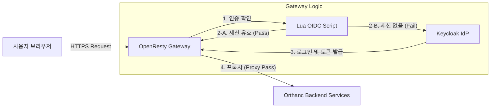

# OpenResty OIDC 게이트웨이 구현 가이드
# (OpenResty OIDC Gateway Implementation Guide)

이 문서는 `ai4infra` 프로젝트의 **OIDC 게이트웨이 (OIDC Gateway)** 아키텍처와 구현 상세를 설명합니다.
이 게이트웨이는 Orthanc와 같은 백엔드 서비스 앞단에서 **중앙 집중식 보안(Centralized Security)**을 수행하여,
개별 서비스의 설정 변경 없이도 Keycloak 기반의 강력한 인증을 제공합니다.

---

## 0. 최신 보안 아키텍처의 핵심 (Key Pillars of Modern Security)

이 프로젝트는 단순히 "로그인 창"을 만드는 것을 넘어, 의료 데이터 보호를 위한
**최신 보안 표준(State-of-the-Art Security)**을 집약적으로 구현했습니다.

복잡해 보이지만, 최고 수준의 보안을 위해 꼭 필요한 3가지 핵심 기둥이 있습니다.

### 0.1 첫 번째 기둥: 제로 트러스트 게이트웨이 (Zero Trust Gateway)
*   **"아무도 믿지 않는다"**:
    내부망이라도 모든 요청을 의심하고 검증합니다.

*   **중앙 집중식 인증 (Centerlized Auth)**:
    개별 서비스(Orthanc 등)가 아닌, 앞단의 게이트웨이에서 **OIDC(OpenID Connect)** 표준으로 인증을 처리합니다.
    퇴사자 발생 시 Keycloak에서 계정 하나만 끄면 모든 접근이 차단됩니다.

*   **레거시 보호**:
    보안 기능이 없는 구형 연구용 프로그램도 게이트웨이 뒤에 숨겨서 최신 보안을 적용할 수 있습니다.


### 0.2 두 번째 기둥: 동적 암호화 키 관리 (Dynamic Key Management via Vault)
*   **"비밀번호는 텍스트 파일에 없다"**:
    소스 코드나 설정 파일에 비밀번호(DB 암호, 가명화 키 등)를 적어두는 것은 보안 사고의 지름길입니다.

*   **HashiCorp Vault 연동**:
    이 프로젝트는 **Vault**라는 전용 보안 금고를 사용하여, 애플리케이션이 실행되는 순간에만 **동적으로 암호화 키를 발급**받습니다.
    서버가 꺼지면 키도 사라지므로, 디스크를 탈취당해도 데이터는 안전합니다.


### 0.3 세 번째 기둥: 통신 구간 암호화 (End-to-End Encryption with TLS)
*   **"모든 대화는 암호화된다"**:
    사용자의 브라우저부터 게이트웨이까지, 그리고 게이트웨이에서 내부 서비스까지 모든 통신은 **HTTPS(TLS)**로 암호화됩니다.

*   **인증서 기반 신뢰**:
    단순 암호화를 넘어, **인증서(Certificate)**를 통해 "내가 접속한 서버가 진짜 PACS 서버인지"를 증명합니다.
    중간자 공격(Man-in-the-Middle Attack)을 원천 차단합니다.

> **결론**: 이 구조는 금융권이나 글로벌 IT 기업에서 채택하는 **가장 현대적인 보안 아키텍처**입니다.
> 초기 설정은 까다롭지만, 한 번 구축하면 가장 안전하고 관리가 쉬운 환경을 제공합니다.

---

## 1. 아키텍처 개요 (Architecture Overview)

게이트웨이는 사용자의 요청을 가장 먼저 받아 인증 여부를 확인하고, 인증된 요청만을 백엔드 서비스로 전달합니다.
이를 **제로 트러스트 액세스(Zero Trust Access)** 모델의 일부로 볼 수 있습니다.



### 핵심 구성 요소 (Key Components)
- **OpenResty**:
    Nginx 웹 서버에 **LuaJIT(Just-In-Time Compiler)**과 다양한 모듈을 내장한 고성능 웹 플랫폼입니다.
    별도의 인증 서버(Forward Auth)를 거치지 않고 Nginx 내부에서 고속으로 인증 로직을 처리합니다.

- **lua-resty-openidc**:
    OIDC 프로토콜(Discovery, Token Exchange, Session Management)을 구현한 Lua 라이브러리입니다.

- **Keycloak**:
    사용자 계정, 권한 정책, SSO(Single Sign-On)를 담당하는 **아이덴티티 공급자 (IdP)**입니다.

---

## 2. 주요 구성 요소 상세 (Component Details)

### 2.1 커스텀 도커 이미지 (`templates/nginx/Dockerfile`)
기본 `nginx:alpine` 대신 `openresty/openresty:alpine-fat` 이미지를 기반으로 하여,
인증 처리에 필요한 Lua 라이브러리를 추가 설치했습니다.
- `lua-resty-openidc`: OIDC 핵심 로직.
- `lua-resty-http`: Keycloak과 통신하기 위한 HTTP 클라이언트.
- `lua-resty-session`: 브라우저 쿠키 기반의 세션 관리.

### 2.2 인증 스크립트 (`templates/nginx/config/conf.d/oidc_auth.lua`)
모든 서비스에서 공통으로 사용하는 인증 로직을 담고 있습니다.
1.  **디스커버리 (Discovery)**: Keycloak의 `.well-known/openid-configuration` 엔드포인트를 호출하여 공개키 등을 가져옵니다.
2.  **인가 코드 흐름 (Authorization Code Flow)**: 로그인되지 않은 사용자를 Keycloak 로그인 페이지로 리다이렉트합니다.
3.  **세션 관리 (Session Management)**: 로그인 성공 후 발급된 토큰 정보를 암호화하여 브라우저 쿠키에 저장합니다.

### 2.3 서비스 설정과 예외 처리 (`templates/nginx/config/conf.d/orthanc-mock.conf`)
각 서비스의 Nginx 설정 파일에서 `access_by_lua_block` 지시어를 사용하여 인증을 강제합니다.

#### 기본 설정 (Basic Configuration)
```nginx
location / {
    access_by_lua_block {
        local oidc = require("oidc_auth")
        oidc.validate() -- 여기서 인증 여부를 검사하고, 실패 시 차단/리다이렉트
    }
    proxy_pass http://ai4infra-orthanc-mock:8042;
}
```

#### 정적 자산 최적화 (Static Asset Optimization)
CSS, JavaScript, 이미지와 같은 정적 파일 요청시마다 OIDC 세션을 검사하면,
**성능 저하**와 리다이렉트 루프(302 Redirect Loop) 문제가 발생할 수 있습니다.
이를 방지하기 위해 정적 파일은 인증을 **우회(Bypass)**하도록 설정합니다.

```nginx
# 정적 파일은 인증 없이 통과 (Bypass OIDC)
location ~* \.(css|js|png|gif|ico|jpg|jpeg|woff|woff2|ttf|svg)$ {
    proxy_pass http://ai4infra-orthanc-mock:8042;
    proxy_set_header Host $http_host;
}
```

---

## 3. Keycloak 설정 (Keycloak Configuration)

게이트웨이가 정상 작동하기 위해 Keycloak에는 다음과 같은 **클라이언트(Client)** 설정이 필요합니다.

- **Realm**: `ai4infra`
- **Client ID**: `nginx-gateway`
- **Client Authentication**: `On` (Confidential Access Type)
- **Valid Redirect URIs**: 서비스가 리다이렉트될 주소 목록.
    - 예: `https://pacs-mock.ai4infra.internal/redirect_uri`
    - 중요: 주소 뒤에 반드시 `/redirect_uri`를 붙여야 `lua-resty-openidc`가 토큰 교환을 수행할 수 있습니다.

---

## 4. 새로운 서비스 추가 방법 (How to Add Service)

새로운 웹 서비스(예: OpenREM, Slicer)를 추가할 때 다음 절차를 따르십시오.

1.  **Nginx 설정 파일 생성**: `conf.d/` 폴더에 `my-service.conf` 파일을 만듭니다.
2.  **인증 블록 추가**: `location /` 내부에 `oidc.validate()` 코드를 넣습니다.
3.  **예외 처리 추가**: 상단에 정적 파일 정규식(`location ~* \.(css|js)...`) 블록을 추가하여 UI 깨짐을 방지합니다.
4.  **Keycloak 등록**: Keycloak 관리자 페이지에서 `nginx-gateway` 클라이언트의
    **Valid Redirect URIs** 목록에 `https://my-service.../redirect_uri`를 추가합니다.

---

## 5. 문제 해결 (Troubleshooting)

| 증상 (Symptom) | 원인 (Cause) | 해결 방법 (Solution) |
| :--- | :--- | :--- |
| **500 Internal Server Error** | Lua 스크립트 문법 오류 또는 라이브러리 누락 | `docker logs ai4infra-nginx` 명령어로 로그 상세 확인. |
| **502 Bad Gateway** | 백엔드 컨테이너(Orthanc 등) 실행 중지 | `docker ps`로 해당 서비스 상태 확인 및 재시작. |
| **무한 리다이렉트 (Infinite Loop)** | HTTP/HTTPS 프로토콜 불일치 | Nginx 설정에 `proxy_set_header X-Forwarded-Proto https;` 추가 확인. |
| **화면 레이아웃 깨짐 (UI Broken)** | CSS/JS 파일에 대한 인증 요청 차단 | 정적 파일 예외 처리(`location ~* ...`) 블록이 `location /` 보다 위에 있는지 확인. |
| **로그인 후 403 Forbidden** | Keycloak 사용자 권한 부족 | (추후 구현) Keycloak Role 설정 확인. 현재는 인증(Authentication)만 체크함. |
