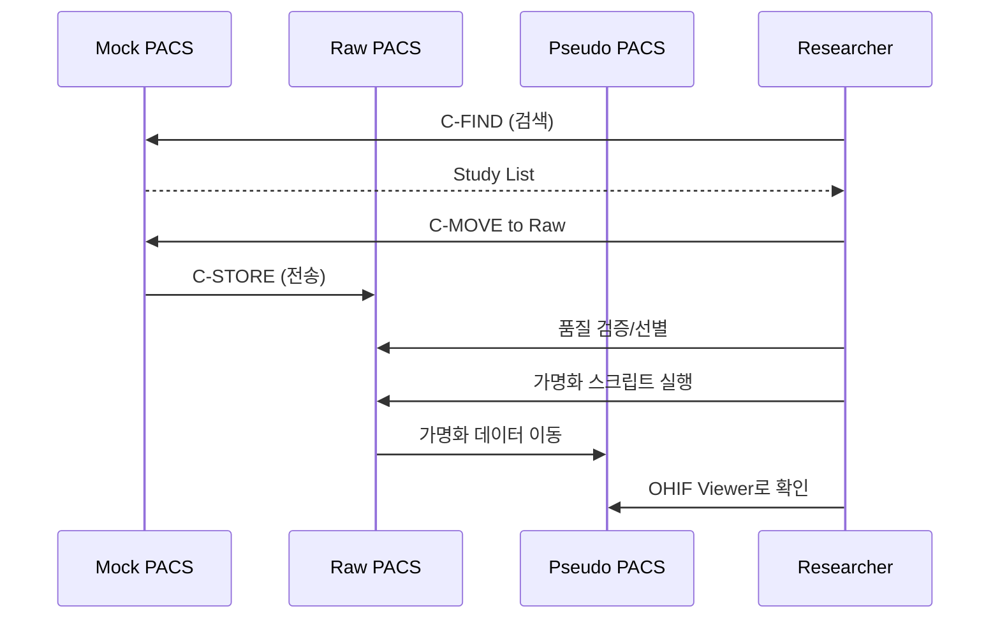

# Orthanc Service Guide

> **Orthanc**는 경량화된 오픈소스 DICOM 서버(PACS)입니다. 
> `ai4infra` 프로젝트에서는 의료 영상 연구를 위한 **3-Tier PACS Architecture**를 제공합니다.

## 1. Architecture Overview

### 🏗️ 3-Tier PACS Structure (Mock → Raw → Pseudo)

```
┌──────────────┐      ┌──────────────┐      ┌──────────────┐
│  Mock PACS   │ ───▶ │   Raw PACS   │ ───▶ │ Pseudo PACS  │
│              │      │              │      │              │
│ 병원 모사     │      │ 선별/전처리   │      │ 가명화/연구   │
│ orthanc_mock │      │ orthanc_raw  │      │orthanc_pseudo│
└──────────────┘      └──────────────┘      └──────────────┘
```

#### 1. **Mock PACS** (병원 원본 모사)
- **역할**: 실제 병원 PACS를 모사한 원본 데이터 저장소
- **AET**: `MOCK_PACS`
- **DB**: `orthanc_mock`
- **포트**: DICOM `4243`
- **도메인**: `pacs-mock.ai4infra.internal`
- **용도**: C-FIND/C-MOVE로 연구에 필요한 데이터 검색 및 다운로드

#### 2. **Raw PACS** (원시 데이터)
- **역할**: Mock에서 가져온 데이터의 품질 검증 및 선별 (Curation)
- **AET**: `RAW_PACS`
- **DB**: `orthanc_raw`
- **포트**: DICOM `4244`
- **도메인**: `pacs-raw.ai4infra.internal`
- **용도**: 가명화 전 원시 데이터 임시 보관 및 전처리

#### 3. **Pseudo PACS** (가명화 데이터)
- **역할**: 개인정보가 제거된 연구용 데이터 저장소
- **AET**: `PSEUDO_PACS`
- **DB**: `orthanc_pseudo`
- **포트**: DICOM `4245`
- **도메인**: `pacs-pseudo.ai4infra.internal`
- **용도**: 연구자에게 제공되는 최종 데이터셋

### 🔧 Technical Components
- **Container**: `jodogne/orthanc-plugins:1.12.1`
- **Database**: PostgreSQL (서비스별 독립 DB)
- **Storage**: 로컬 파일시스템 (서비스별 독립 볼륨)
- **Gateway**: Nginx 리버스 프록시
- **Viewer**: OHIF Viewer 플러그인

### 🔐 Custom Entrypoint Strategy
환경변수 기반 동적 설정을 위해 Custom Entrypoint 사용:
- **Template**: `orthanc.json` (플레이스홀더 포함)
- **Script**: `entrypoint.sh` (sed로 런타임 치환)
- **Variables**: DB명, AET, 비밀번호 등

---

## 2. Installation

### 기본 서비스 (Single Instance)
```bash
make install-orthanc
```

### Multi-Instance (3-Tier)
```bash
# 개별 설치
python scripts/ai4infra/ai4infra-cli.py install orthanc-mock
python scripts/ai4infra/ai4infra-cli.py install orthanc-raw
python scripts/ai4infra/ai4infra-cli.py install orthanc-pseudo

# 또는 Makefile 타겟 추가 후 일괄 설치 (예정)
# make install-pacs-stack
```

**자동 처리 사항**:
- PostgreSQL DB 및 사용자 생성 (서비스별)
- Docker 네트워크 연결
- Nginx 설정 복사 및 재시작
- 헬스 체크 및 로그 검증

---

## 3. Configuration

### Environment Variables (`.env`)
```bash
# 공통
ORTHANC_ADMIN_PASSWORD=your_password
ORTHANC_DB_PASSWORD=your_db_password

# 서비스별 (자동 생성)
ORTHANC_AET=ORTHANC          # 기본
ORTHANC_DB_NAME=orthanc      # 기본
```

### Service Config (`config/orthanc-*.yml`)
각 서비스는 독립된 설정 파일을 가집니다:
- `orthanc.yml` (기본)
- `orthanc-mock.yml` (Mock PACS)
- `orthanc-raw.yml` (Raw PACS)
- `orthanc-pseudo.yml` (Pseudo PACS)

**주요 설정**:
```yaml
env_vars:
  ORTHANC_AET: "MOCK_PACS"        # Application Entity Title
  ORTHANC_DB_NAME: "orthanc_mock" # Database name
  ORTHANC__POSTGRESQL__DATABASE: "orthanc_mock"

compose_vars:
  ORTHANC_DICOM_PORT: "4243"      # 호스트 포트 매핑
  ORTHANC_MEM_LIMIT: "1g"
```

---

## 4. Usage

### 🌐 Web Access
| Service | URL | Credentials |
|---------|-----|-------------|
| Mock | `http://pacs-mock.ai4infra.internal` | admin / `.env` 참조 |
| Raw | `http://pacs-raw.ai4infra.internal` | admin / `.env` 참조 |
| Pseudo | `http://pacs-pseudo.ai4infra.internal` | admin / `.env` 참조 |
| 기본 | `http://pacs.ai4infra.internal` | admin / `.env` 참조 |

### 📡 DICOM Access
| Service | AET | Port |
|---------|-----|------|
| Mock | MOCK_PACS | 4243 |
| Raw | RAW_PACS | 4244 |
| Pseudo | PSEUDO_PACS | 4245 |
| 기본 | ORTHANC | 4242 |

### 💻 DICOM Operations Example
```bash
# C-ECHO (연결 테스트)
dcmtk echoscu -v localhost 4243 -aet CLIENT -aec MOCK_PACS

# C-FIND (Study 검색)
dcmtk findscu -v localhost 4243 -aet CLIENT -aec MOCK_PACS \
  -k QueryRetrieveLevel=STUDY \
  -k PatientID="*" \
  query.dcm

# C-MOVE (데이터 전송)
dcmtk movescu -v localhost 4243 -aet CLIENT -aec MOCK_PACS \
  +P 4244 -aem RAW_PACS \
  -k QueryRetrieveLevel=STUDY \
  -k StudyInstanceUID="1.2.3..."
```

---

## 5. Typical Workflow (연구 데이터 수집)



**단계별 설명**:
1. **Search & Download**: Mock에서 필요한 Study 검색 후 Raw로 이동
2. **Curation**: Raw에서 품질 검증 및 불필요한 데이터 제거
3. **De-identification**: DICOM 태그에서 개인정보 제거
4. **Final Storage**: Pseudo에 최종 데이터셋 저장
5. **Research**: Pseudo의 OHIF Viewer로 연구 진행

---

## 6. Troubleshooting
- **원인**: Entrypoint 스크립트가 환경변수를 제대로 치환하지 못했음.
- **해결**: `.env` 파일이 올바르게 로드되었는지, `config/orthanc.yml`의 `env_vars`에 해당 변수(`ORTHANC_DB_PASSWORD`)가 선언되어 있는지 확인.

### `Plugin ... No available configuration`
- **원인**: `orthanc.json`에서 `Plugins` 경로 리스트가 누락됨.
- **해결**: `["/usr/share/orthanc/plugins", ...]` 추가.

### `HTTP 404 Not Found` (Nginx)
- **원인**: Nginx 설정 파일(`orthanc.conf`)이 컨테이너에 없거나 오타.
- **해결**: `make install-orthanc`를 다시 실행하여 설정 파일을 복사하고 Nginx 리로드.
